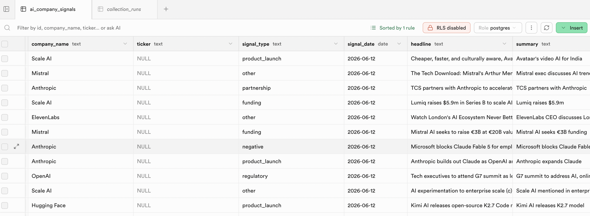
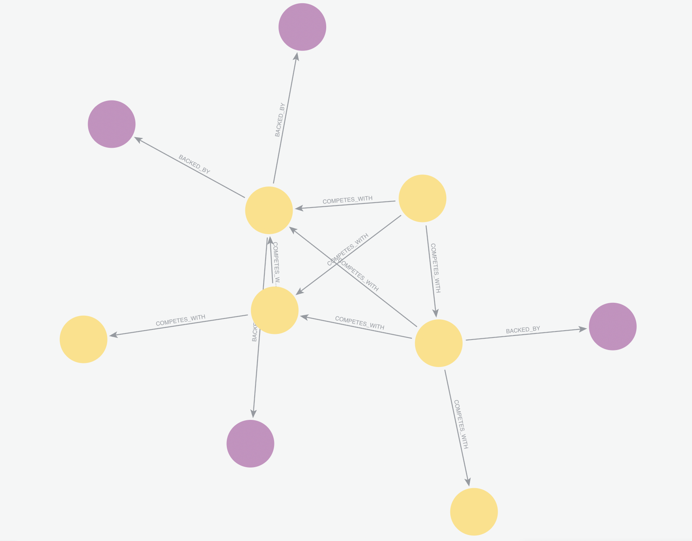

# AI Vendor Intelligence Platform

> Automated competitive intelligence briefs on 50 AI companies using intelligence and analytical agents, refreshed daily and delivered via API.

## Architecture Overview

```
collector/          — Data ingestion layer
  edgar_collector   — SEC filings (10-K, 10-Q, 8-K) for public companies
  github_collector  — GitHub activity: stars, commits, contributors, releases
  arxiv_collector   — Research paper indexing by company affiliation
  news_collector    — News articles and press releases via RSS/scraping
  db.py             — Shared PostgreSQL helpers (psycopg2)

agents/             — LLM analysis layer (Groq-backed, Langfuse-traced)
  financial/        — Revenue signals, funding rounds, burn indicators
  technology/       — Model releases, benchmark results, OSS activity
  news/             — Sentiment, key events, reputational signals
  personnel/        — Executive hires/departures, headcount trends
  competitive/      — Positioning shifts, partnership announcements
  supervisor/       — Orchestrates sub-agents, merges into final brief

infrastructure/     — Terraform (AWS Lambda + IAM)
api/                — Lambda handler + brief formatter
frontend/           — Single-page brief viewer
evaluation/         — Labeled ground-truth briefs + eval runner
prompts/            — Shared prompt fragments
```

## Setup

```bash
# 1. Clone and enter the repo
git clone <repo-url>
cd AI-Vendor-Intelligence-Platform

# 2. Copy and fill in environment variables
cp .env.example .env
# Edit .env — at minimum set DATABASE_URL and GROQ_API_KEY

# 3. Install collector dependencies
pip install -r collector/requirements.txt

# 4. (Optional) Provision infrastructure
cd infrastructure
terraform init
terraform apply
```

## Environment Variables

| Variable | Description |
|---|---|
| `DATABASE_URL` | PostgreSQL connection string |
| `GITHUB_TOKEN` | GitHub PAT for higher rate limits |
| `GROQ_API_KEY` | Groq API key for LLM inference |
| `LANGFUSE_PUBLIC_KEY` | Langfuse observability (public) |
| `LANGFUSE_SECRET_KEY` | Langfuse observability (secret) |
| `LANGFUSE_HOST` | Langfuse host (default: cloud) |
| `NEO4J_URI` | Neo4j URI for graph relationships |
| `NEO4J_USER` | Neo4j username |
| `NEO4J_PASSWORD` | Neo4j password |
| `AWS_REGION` | AWS region for Lambda deployment |

## Database Schema

### Supabase (PostgreSQL) — Signal Store

The `ai_company_signals` table stores all collected intelligence signals:



**Columns:**
- `company_name` (text) — Company name (indexed, matches seed list)
- `ticker` (text) — Stock ticker or identifier
- `signal_type` (text) — Category: `funding`, `executive_change`, `product_launch`, `partnership`, `negative`, `regulatory`, `github_release`, `github_activity`, `research_paper`, `other`
- `signal_date` (date) — When the signal occurred
- `headline` (text) — Title or summary
- `summary` (text, ≤150 chars) — One-line description
- `source_url` (text) — URL to original source
- `importance_score` (int 0–100) — Relative weight for brief inclusion
- `raw_data` (jsonb) — Collector-specific metadata
- `langfuse_trace_id` (text) — Link to observability
- `created_at` (timestamp) — When row was inserted

### Neo4j (AuraDB) — Competitive Graph

The graph models competitive relationships and investor backing:



**Nodes:**
- **Company** — 50 AI vendors with `name` (unique), `ticker`, `stage`, `founded_year`, `github_org`
- **Investor** — VCs and strategic investors

**Relationships:**
- `COMPETES_WITH` — Bidirectional competitive parity (22 pairs, 44 edges)
- `BACKED_BY` — Company ← Investor funding direction

## Current Signal Coverage

| Collector | Companies | Signals | Signal Types |
|-----------|-----------|---------|--------------|
| EDGAR | 3 | 8 | annual_filing, executive_change |
| GitHub | 50 | 125 | github_release, github_activity |
| ArXiv | 50 | 440 | research_paper |
| News | 50 | 413 | funding, product_launch, negative, partnership, regulatory, acquisition, other |
| **Total** | **50** | **987** | **12** |

## Running the Collectors

```bash
# Run all collectors in sequence
python collector/run_all.py

# Run individually
python collector/edgar_collector.py
python collector/github_collector.py
python collector/arxiv_collector.py
python collector/news_collector.py

# Verify data quality
python collector/verify.py
```

## Neo4j Graph

```bash
# Seed the competitive graph (run once)
python graph/seed.py
```

Graph contains:
- 50 Company nodes
- 8 Investor nodes  
- 22 COMPETES_WITH relationships (bidirectional)
- 17 BACKED_BY relationships

## Known Limitations

- Private companies with no SEC filings or press coverage produce thin briefs
- Neo4j graph is manually seeded for 50 companies — gaps exist for newer entrants
- News collector hits Groq free tier daily token limit (100K tokens/day) 
  at ~33 companies — re-run next day to collect remaining signals
- ArXiv search matches company name as a string — may return false positives 
  for generic names (Modal, Notion, Writer, Chroma)
- GitHub org names in seed_companies.json are best-guess — 5 orgs not found
- Evaluation dataset not yet built — accuracy metrics pending week 4

## Mycroft Framework

This project is an open-source contribution to the 
[Humanitarians AI Mycroft framework](https://github.com/Humanitariansai/Mycroft).
It sits in the Intelligence Agents layer (Financial Report Agent + 
News Monitoring Agent) and the Analytical Agents layer (Research Agent).
